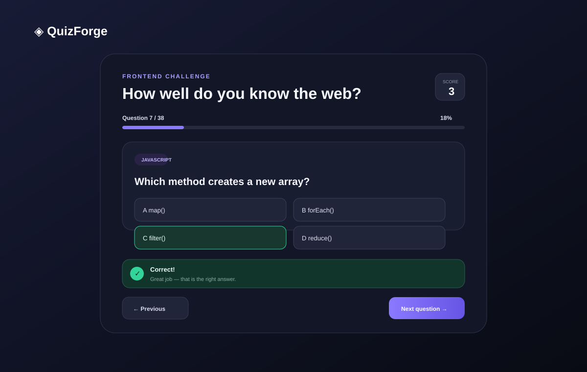

# QuizForge — React Quiz Sample

A polished, responsive single-page quiz built with React and Vite around the supplied Chingu quiz API. This is a **practice/sample implementation** for learning and comparison; it is not intended to be submitted as a user's own Chingu Solo Project.



## What this sample demonstrates

- React component architecture with a dedicated quiz hook
- Fetching and validating an external JSON API
- Dynamic question count — the UI never assumes 10 questions
- Safe answer shuffling while preserving the correct answer
- One-answer-per-question locking
- Derived scoring that remains correct when using Previous
- Correct/Incorrect feedback with text and non-color cues
- Previous / Next navigation
- Final result and Play Again flow
- Loading and recoverable error states
- Responsive layout down to a 320px viewport
- Keyboard support: `1–9` selects an available answer and `Enter` continues
- Semantic buttons, focus states, ARIA status messaging, and reduced-motion support
- No horizontal overflow on narrow screens
- GitHub Pages deployment workflow included

## API

The app fetches the supplied endpoint:

`https://johnmeade-webdev.github.io/chingu_quiz_api/trial.json`

The app reads the number of questions from the returned array. The current API data contains 38 questions, but that number is not hard-coded anywhere in the UI logic.

The API also contains questions with fewer than four choices. The interface therefore renders the choices returned by the API instead of assuming exactly four.

## Tech stack

- React 19.3
- Vite 8.3
- Modern JavaScript / ES modules
- CSS
- Fetch API

The package versions reflect the current package releases checked while preparing this sample. React's npm package currently lists 19.3.0, Vite lists 8.3.2, and `@vitejs/plugin-react` lists 6.1.1. citeturn0search2turn0search4turn0search0

## Project structure

```text
chingu-quiz-sample/
├── .github/
│   └── workflows/
│       └── deploy.yml
├── docs/
│   └── preview.svg
├── src/
│   ├── components/
│   │   ├── AnswerButton.jsx
│   │   ├── FeedbackMessage.jsx
│   │   ├── Header.jsx
│   │   ├── PageShell.jsx
│   │   ├── ProgressIndicator.jsx
│   │   ├── QuestionCard.jsx
│   │   ├── QuizNavigation.jsx
│   │   └── StateScreens.jsx
│   ├── hooks/
│   │   └── useQuiz.js
│   ├── utils/
│   │   └── quiz.js
│   ├── App.jsx
│   ├── main.jsx
│   └── styles.css
├── index.html
├── package.json
├── vite.config.js
└── README.md
```

## Run locally

Requirements: Node.js 20.19+ and npm.

```bash
npm install
npm run dev
```

Open the local URL printed by Vite.

### Production build

```bash
npm run build
```

### Preview the production build

```bash
npm run preview
```

## Architecture decisions

### `useQuiz`

All game state and transitions live in `src/hooks/useQuiz.js`. The UI components stay focused on presentation and user interaction.

### Components

The app is intentionally split into small components so each responsibility is easy to inspect and change: header, progress, question card, answer button, feedback, navigation, and state/result screens.

### Derived score

The score is calculated from the answer map rather than incremented manually. Going backward therefore cannot accidentally award the same point twice.

### Stable React keys

The API contains repeated question IDs, so the API `id` is not used as a React key. Answer keys are combined with the current question position for stable list keys.

### Choice shuffling

Choices are shuffled once during API normalization. Each choice carries its `isCorrect` flag, so the correct answer remains correct after shuffling.

### Error handling

The app handles failed requests, non-OK responses, malformed JSON data, empty question arrays, and questions without a matching correct answer with a visible retry screen.

## UI / UX quality checks

The interface was designed against the high-value concerns in Chingu's Solo Project evaluation guidance: clear UI hierarchy, responsive behavior, accessibility basics, readable code structure, and a working end-to-end experience.

Specific choices include:

- clear progress and score at the top of the quiz
- answer cards with visible hover/focus/selected/locked/correct/incorrect states
- text labels in addition to color for answer feedback
- disabled buttons that are visibly disabled
- one-column choices on narrow screens
- no decorative dependency that is required for the core experience
- `prefers-reduced-motion` support

## Responsive test matrix

Before using the sample, check these viewport widths in DevTools:

| Width | Expected result |
| --- | --- |
| 320px | One-column answers, no horizontal overflow |
| 375px | One-column answers, compact navigation |
| 768px | Comfortable tablet layout |
| 1024px | Full desktop card with two-column answers |
| 1440px | Centered card with generous whitespace |

## Console / production verification

Run:

```bash
npm install
npm run build
npm run preview
```

Then open the preview in a browser and keep DevTools Console open while completing the full quiz. There should be no React warnings or uncaught errors.

> Note: the authoring environment used to assemble this ZIP did not have working DNS access to the npm registry, so `npm install` could not be completed here. The source was therefore statically reviewed, but the local environment could not truthfully claim a completed Vite production build. Running the commands above on a normal Node/npm environment is the final runtime verification step.

## Git history

The sample package is prepared to be placed in a Git repository. The intended history is split into meaningful changes rather than one giant commit:

1. initialize React/Vite project
2. add API normalization and quiz hook
3. add quiz components and interaction flow
4. add responsive UI and accessibility states
5. add deployment workflow and documentation

The ZIP includes the GitHub Pages workflow, but a GitHub repository cannot be made public from this offline sample environment. See the setup steps below.

## GitHub Pages deployment

The repository includes `.github/workflows/deploy.yml`.

After creating your own public GitHub repository:

```bash
git remote add origin https://github.com/YOUR_USERNAME/quizforge-chingu-sample.git
git branch -M main
git push -u origin main
```

Then in GitHub:

1. Open **Settings → Pages**.
2. Under **Build and deployment**, choose **GitHub Actions**.
3. Push to `main` (or run the workflow manually).
4. GitHub Actions will build `dist` and deploy it to Pages.
5. The Pages URL will be shown under **Settings → Pages**.

## Meaningful Git history (local sample)

If you want to recreate the intended history yourself:

```bash
git init
git add package.json vite.config.js index.html src/main.jsx
git commit -m "chore: initialize React quiz app"

git add src/utils src/hooks
 git commit -m "feat: add quiz data normalization and state logic"

git add src/components src/App.jsx
 git commit -m "feat: build quiz interaction flow"

git add src/styles.css
 git commit -m "style: add responsive quiz experience"

git add README.md docs .github
 git commit -m "docs: add project guide and deployment workflow"
```

## Future ideas

- timed mode
- category filtering
- difficulty selection
- local high scores
- answer review screen
- topic performance analytics
- theme switcher

## Sample disclaimer

This repository is a learning/sample project built from the supplied brief. It is intended for inspection and practice, not as a user's own Chingu submission.
